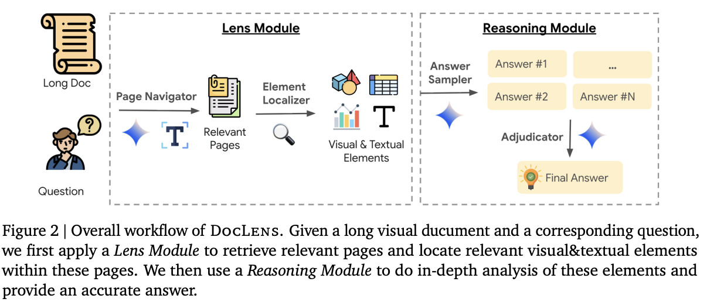

DocLens is a layout-aware observer: instead of flattening a PDF to text, it preserves page index and bounding boxes so downstream reasoning can point back to exactly where evidence lives.

Figures are never embedded as pixels; we embed their caption, legend OCR, and a short VLM summary, while keeping figure_id, page_idx and bbox on the node for grounding.
