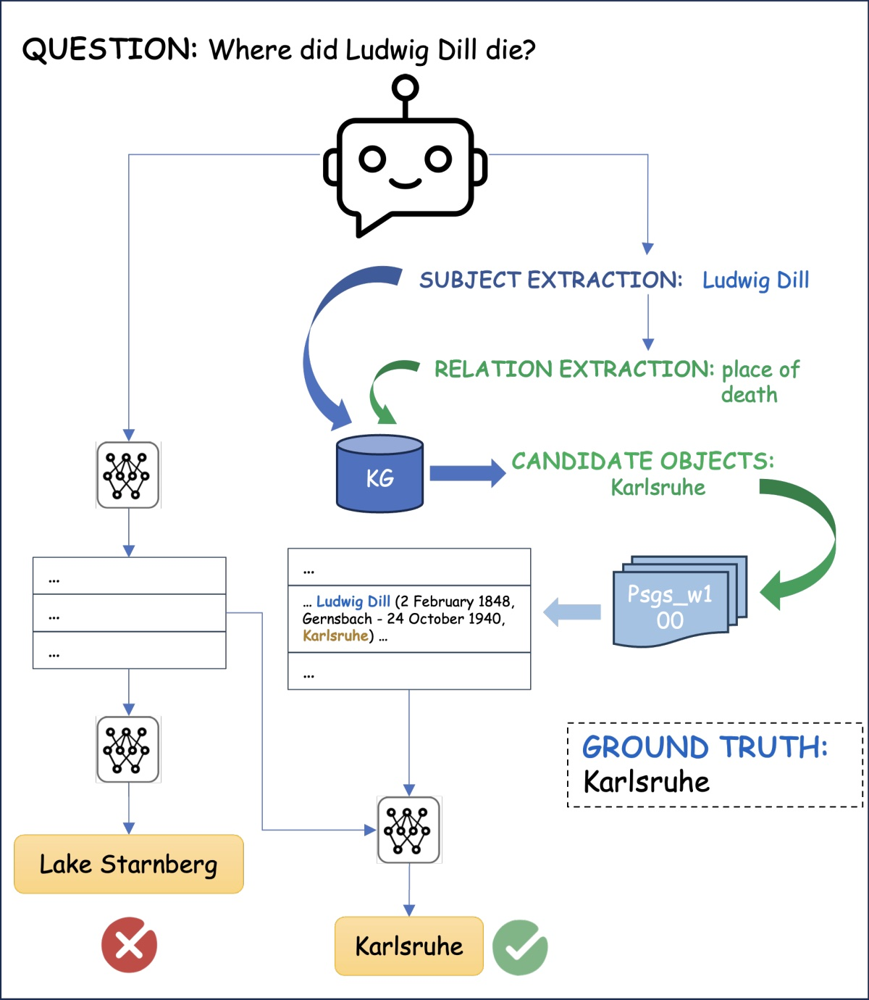
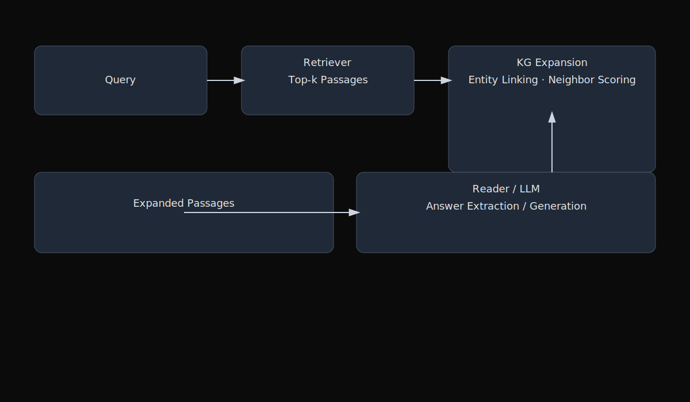
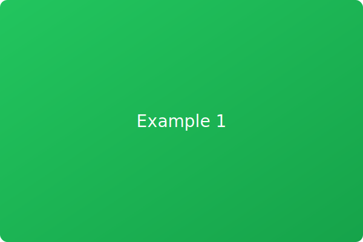
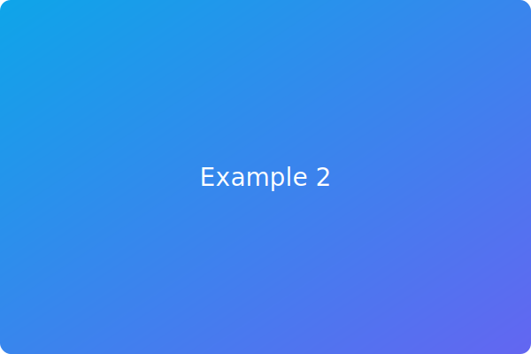
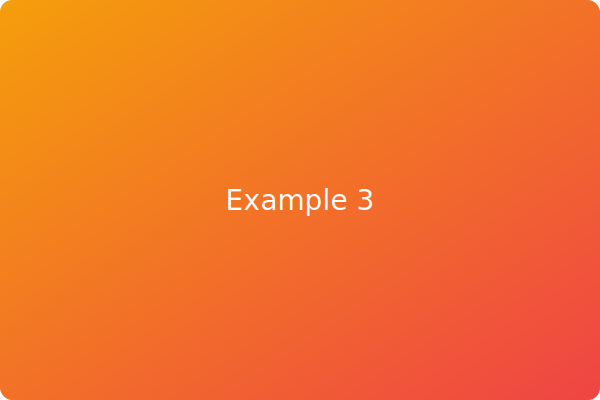

<section class="wide">
  <h2>Overview</h2>
  

    We propose a retrieval-based QA method that <strong>expands candidate passages</strong> with structured context from a knowledge graph (KG). By injecting entities and relations that connect the question and passages, we improve recall on entity-centric queries while preserving precision.
  

</section>

<figure class="wide">
  
  <figcaption>KG-driven passage expansion exposes relevant entities and relations for better retrieval and answer grounding.</figcaption>
</figure>

<!-- 

  

    <h3>Method</h3>
    

      Given a query and a set of retrieved passages, we match entities in a KG and expand each passage with a small set of <em>salient</em> neighbors (entities/relations) subject to a budget. The expanded text is fed to a reader (or LLM) for answer extraction or generation.
    

    <ul>
      <li>Entity linking → KG lookup → expansion candidate scoring</li>
      <li>Budgeted selection to avoid noise and verbosity</li>
      <li>Plug-and-play with standard RAG pipelines</li>
    </ul>
  

  

    <figure>
      
      <figcaption>System diagram</figcaption>
    </figure>
  

 -->

<!-- 

  <strong>Key takeaway.</strong> KG expansion improves recall for entity-centric questions and yields higher answer quality with modest added cost.

 -->

<!-- <h3>Results</h3>

  <figure>
    
    <figcaption>Qualitative example 1</figcaption>
  </figure>
  <figure>
    
    <figcaption>Qualitative example 2</figcaption>
  </figure>
  <figure>
    
    <figcaption>Qualitative example 3</figcaption>
  </figure>

 -->

<!-- <h3>Resources</h3>
<ul>
  <li><a href="https://aclanthology.org/2024.lrec-main.1225.pdf" target="_blank" rel="noopener">Paper (PDF)</a></li>
  <li><a href="https://aclanthology.org/2024.lrec-main.1225/" target="_blank" rel="noopener">Anthology page</a></li>
</ul> -->
