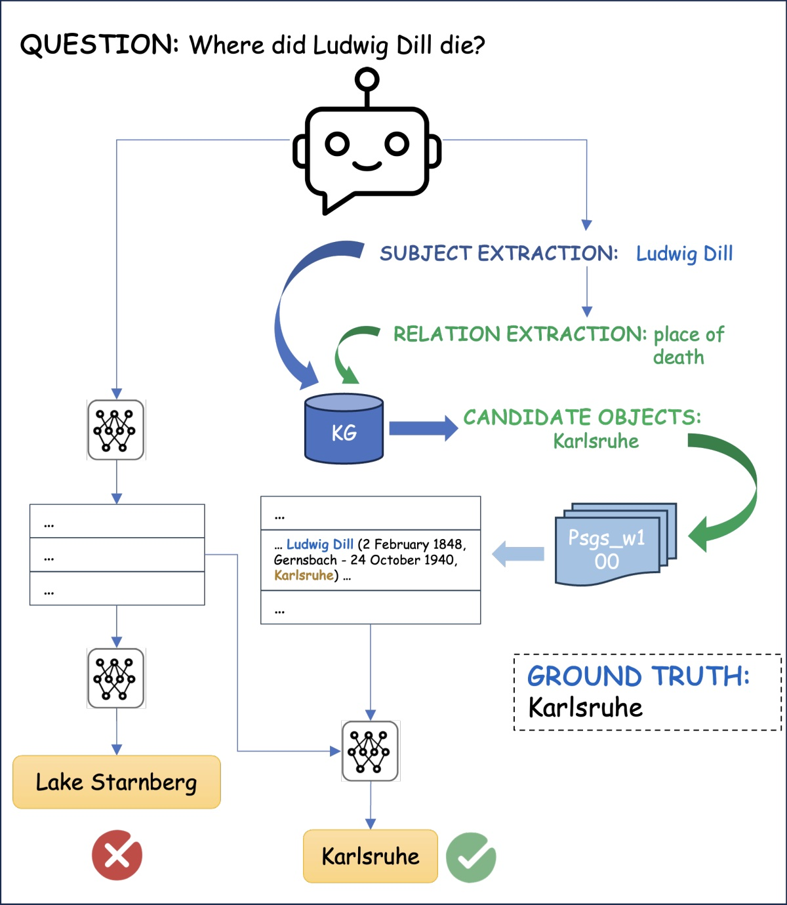

<section class="wide">
  <h2>Overview</h2>
  

    We explore whether a multimodal passage retriever can bolster open-domain QA by combining <strong>knowledge-graph entity features</strong> with dense text retrieval, compensating for dense neural retrievers' weakness on rare entities and facts.
  

</section>

<figure class="wide">
  
  <figcaption>KG-driven passage expansion exposes relevant entities and relations for better retrieval and answer grounding.</figcaption>
</figure>

<section class="wide">
  <h3>Approach</h3>
  

    We devise a multimodal retriever that combines entity features from a knowledge graph with textual data. A distantly supervised question–relation extraction model enhances retrieval through the KG, injecting structured context that connects questions to passages reachable via entities and relations rather than surface similarity alone.
  

  <h3>Results</h3>
  

    Across several datasets, the approach improves retrieval precision in some settings and confirms enhanced performance on entity-centric questions, indicating that knowledge-graph context complements dense retrieval for rare entities. Challenges remain for complex, generalized questions.
  

</section>
